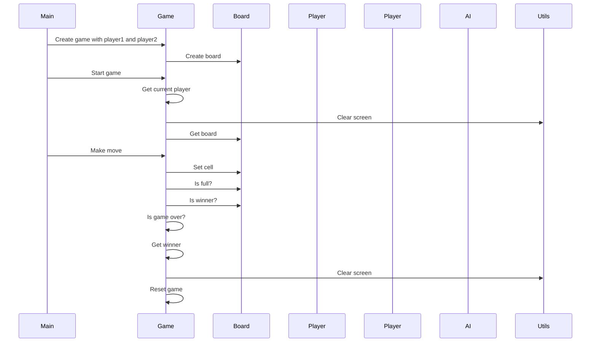

## Implementation approach:
For the tic tac toe game, we will use the Pygame library to create a user-friendly and visually appealing interface. We will implement the game logic using object-oriented programming principles. For the AI opponent in single-player mode, we will use the Minimax algorithm to make optimal moves. 

## Python package name:
```python
"tic_tac_toe"
```

## File list:
```python
[
    "main.py",
    "game.py",
    "board.py",
    "player.py",
    "ai.py",
    "utils.py",
]
```

## Data structures and interface definitions:
```mermaid
classDiagram
    class Game{
        +__init__(self, player1: Player, player2: Player)
        +start(self) -> None
        +reset(self) -> None
        +get_current_player(self) -> Player
        +make_move(self, row: int, col: int) -> bool
        +is_game_over(self) -> bool
        +get_winner(self) -> Union[Player, None]
        +get_board(self) -> List[List[Union[Player, None]]]
    }
    class Board{
        +__init__(self)
        +get_cell(self, row: int, col: int) -> Union[Player, None]
        +set_cell(self, row: int, col: int, player: Player) -> None
        +is_full(self) -> bool
        +is_winner(self, player: Player) -> bool
        +get_empty_cells(self) -> List[Tuple[int, int]]
    }
    class Player{
        +__init__(self, name: str, symbol: str)
        +get_name(self) -> str
        +get_symbol(self) -> str
    }
    class AI{
        +__init__(self, symbol: str)
        +get_next_move(self, game: Game) -> Tuple[int, int]
        -minimax(self, game: Game, depth: int, maximizing_player: bool) -> int
    }
    class Utils{
        +clear_screen() -> None
    }
    Game "1" -- "1" Board: has
    Game "2" -- "2" Player: has
    Game "1" -- "1" AI: has
    AI "1" -- "1" Player: is
}
```

## Program call flow:


## Anything UNCLEAR:
The requirement is clear to me.